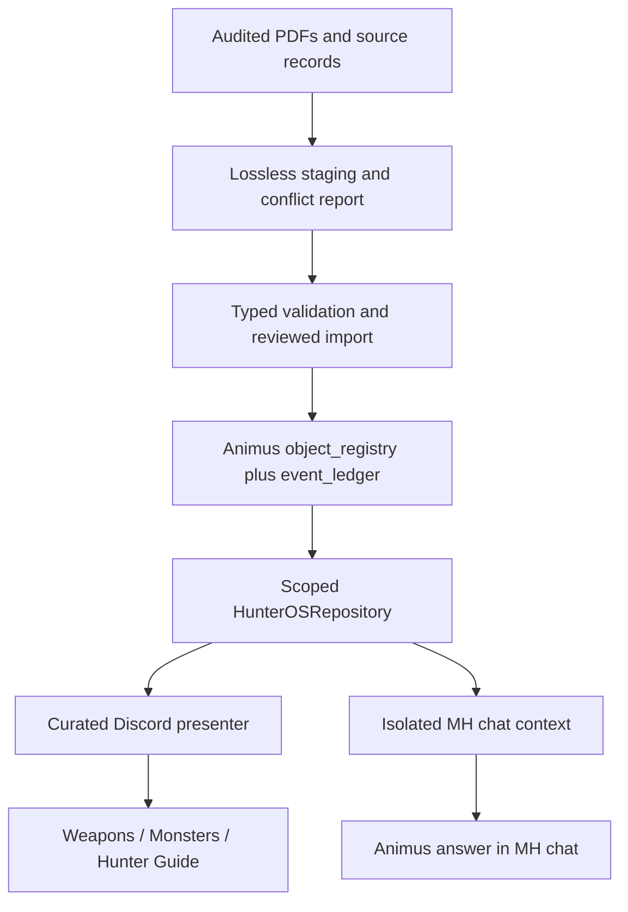

# Hunter OS SQL domain: audit and implementation plan

Date: 2026-09-22. Status: audit complete; steps 1 through 3 implemented for review; live migration pending.

## Implementation update

Step 2 adds the nine typed payload families, deterministic eligibility audits, exact horn/ammo lookups, bounded search and separate operator inspection/history. See [repository contract](HUNTER_OS_REPOSITORY.md). The final combined local run passed **470 tests with one optional skip**, including **113 new Hunter-domain tests** across SQLite and PostgreSQL 16. No source records have been imported. Step 3 now has an [offline import preview](../operators/hunter-os-import-preview.md): four proposed payloads and 101 preserved forum blocks, all 105 held, with no conversion conflicts in this snapshot. Installed-wheel execution and deterministic replay are verified. The [operator SQL importer](../operators/hunter-os-sql-import.md) now adds scoped baseline comparison, atomic candidate staging and unchanged replay. This remains test-only implementation; no live registry was read or changed. Hosted CI on the persistence PR exposed logging-test interference and SQL result typing issues, corrected in a follow-up; the parent stack head `c430a80` now passes hosted CI. New-head CI and the legacy Chroma dependency audit remain merge gates.

The persistence foundation is implemented on `codex/hunter-os-persistence`, based on the inspected main revision below. It adds explicit SQL scope enforcement, migration `002`, compatible Core/Kernel ledger storage, atomic version changes, Hunter envelope values, effective timestamps, and a read-only operator preflight. See [operator instructions](../operators/hunter-os-persistence.md).

Validation: **51 new regression tests passed** across SQLite and disposable PostgreSQL 16; **278 existing tests passed, one optional test skipped**. The new tests include migration evidence preservation, duplicate refusal, Core/Kernel create/read/update/delete coexistence, synchronized concurrent writers, private/reclassified/deleted history, rollback on outbox failure and temporal boundaries. Ruff and targeted type checks passed. PostgreSQL 14/15 coverage is configured in CI but has not been run locally.

The findings and original validation below describe the pre-implementation snapshot. H1, H2, H3, H4, H6 and H9 have foundation changes in this branch; this does not close their later domain/deployment gates. Legacy Core-shaped database conversion, typed payload validation, idempotent content import, publisher fixes and live bot isolation remain pending. No live database or Discord content was changed.

## Decision

Use Animus's existing durable object registry for the complete Hunter OS knowledge base, behind a strictly scoped repository. Discord presents curated summaries; the separate MH chat retrieves details. Do not connect the current generic store directly to shared chat: its tenant/security filtering and migration compatibility need work first.

This audit supersedes the card-first ordering in the pasted handoff. The MHW project's **Discord Setup Design** conversation now asks for SQL-backed knowledge and a clean presentation across **three Forum Channels**. Its latest brief asks for persistence inspection and a minimum implementation proposal before application changes. No application code, live database, Discord configuration, forum messages, or command registration was changed in this audit.

## Evidence and current state

| Source | Exact inspected revision | What it contains |
|---|---|---|
| Animus main | `d11676b442c9bd40eb850c598f861855e41ff76f` | Core SQL object store, separate Kernel SQL memory store, Alembic migration 001, shared contracts |
| Draft PR [129](https://github.com/Arete-Consortium/animus/pull/129) | `854a7a64617e4493f02299a1a20112c8104103d7` | Four YAML records, typed models, audit/search/chat policy, bot routing, text publisher |
| `deploy/hunter-os-text-v1` | `c3f5a3c9eb3fc98d80d5c8f199f14425de274263` | Expanded Markdown, individual forum-post publisher, flat-message cleanup tool; lacks PR 129's typed records and chat boundary |
| MHW: Discord Setup Design | Latest five turns read on audit date | Three Forum Channels confirmed; clutter from detailed HH entries; SQL/repository proposal; concise embeds and monster thumbnails preferred |
| MHW: Finish Hunter OS v1 | Latest five turns and returned attachment inventory read | Real Wilds imagery preferred; eight PDF attachments plus one image exposed by this task; factual text must be deterministic |

The deployment branch differs from main in 79 files, including unrelated lint/build edits. Do not merge or cherry-pick the whole branch to recover Hunter content. Preserve both branches and import only explicitly inventoried sources.

The audit was prepared on `codex/hunter-os-sql-audit`. Implementation started on `codex/hunter-os-persistence` after refreshing main and confirming the same inspected revision.

## Findings, ordered by implementation impact

### H1 — High: the generic SQL store is not a privacy boundary

Evidence: `packages/core/animus/durability/postgres_store.py:311`, `:598`, `:612`, `:663`.

`owner_id` and `workspace_id` constructor settings are retained but are not applied by `retrieve`, `retrieve_version`, `list_current`, or the object-ID mutation queries. `list_current` filters only supersession and optional artifact type. A local probe configured `ws-hunter-os`, wrote a synthetic confidential object in `ws-private`, and retrieved/listed it through that store. This demonstrates absent store-level isolation, not an observed Discord disclosure.

Required: fixed SQL predicates for owner, Hunter workspace, domain, security class, schema, allowed artifact types and eligible lifecycle. Every read path, including history, exact lookup and search, must enforce them before returning payloads. Writes need the same scope guard. Inject only this scoped interface into chat; never a general MemoryLayer/store handle. An empty result or DB error must produce an unavailable/unknown answer, with no fallback.

### H2 — High: Core ORM and operator migrations describe different databases

Evidence: `database/migrations/versions/001_initial_schema.py`, `packages/core/animus/durability/postgres_store.py:162`, and `packages/kernel/src/animus_kernel/memory/stores/durable.py:50`.

Migration 001 lacks Core's `object_registry.tags` column and its `outbox_entries` table. Its `event_ledger` uses `event_kind`, actor/object references and event data, while Core expects `event_id`, `event_type`, object version, principal and integrity hash. Kernel uses the migration-style ledger. `create_tables()` does not reconcile existing table definitions.

Reproduction: execute migration 001 into a fresh temporary SQLite database, then call Core `list_current()`. It fails with missing `object_registry.tags`. This is independent of game data. SQLite execution establishes schema incompatibility; a live PostgreSQL migration was not attempted.

Required: preserve the migration/Kernel ledger as the compatibility baseline and adapt Core's event writer/reader to that shape, placing version and integrity metadata into documented event data. Add registry tags/outbox and required constraints through reviewed additive migrations. First inspect the actual deployed schema: recognize migration-shaped and Core-created layouts explicitly; reject unknown or mixed layouts. A Core-shaped production ledger requires its own backed-up conversion preserving all events, not renaming/deleting columns blindly. Cross-test Kernel and Core on the same migration-created database.

### H3 — High: the suggested Hunter envelope violates current contracts

Evidence: `packages/contracts/src/animus_contracts/schemas/object_version.schema.json:31` and generated `packages/types/src/animus_types/object_version.py`.

Five proposed values fail validation: dotted object ID, `workspace_id="hunter-os"`, `subject_domain="monster_hunter_wilds"`, `artifact_type="monster"`, and `epistemic_status="verified"`. The store also skips envelope validation when the optional contracts package is absent, allowing installation-dependent behavior.

Minimum proposal: use compliant IDs such as `mhw-monster-rathian`; deliberately extend contract domain/type enums for Hunter and permit the exact `hunter-os` workspace without weakening validation for arbitrary workspace values. Regenerate shared types and test old consumers. Use existing envelope epistemic values (`supported`/`unverified`); preserve the independent Hunter verification state in a validated payload. Require Hunter payload/envelope validation regardless of optional package installation. Never disable contracts to get the import through.

### H4 — High: initial writes can create duplicate current objects

Evidence: Core ORM `:171`, `store():424`, `update():477`; migration 001's unique object/version index is absent from Core `create_tables()` metadata.

Reproduction on ORM-created SQLite: store the same object twice; `retrieve` raises `MultipleResultsFound`. The `expected_version` check is a read followed by an insert, without a database compare-and-swap or locking guarantee. The duplicate-create failure is reproduced; the concurrent-update race is a source finding, not a PostgreSQL concurrency test result.

Required: one unique object/version key plus a unique current-version constraint compatible with the chosen identity scope; atomic expected-version updates; transactionally commit registry, event and outbox. Preflight existing duplicates and stop with a report. Never choose a duplicate winner automatically. Re-importing an unchanged source hash must be a no-op with no extra version/event.

### H5 — High: publishing state is not bound to its destination

Evidence: deployment `tools/hunter_os_publish_forums.py`, `_load_registry` and `_publish_forum`.

The registry keys on content family/block but omits guild and forum IDs. A fake-client probe changed the target forum and observed an edit to the old thread/message. Malformed registry JSON becomes an empty registry, potentially recreating every post. `--dry-run` plans local changes; it does not verify actual Discord destinations or permissions.

Required before reusing this publisher: persist and validate guild/forum/thread/message ownership and parentage; stop on destination mismatch or corrupt state; validate each source audit before planning; durable publication intent and reconciliation after ambiguous create responses. Keep `allowed_mentions` disabled. No cleanup until replacements are reviewed, with exact message IDs and a separate cleanup plan.

### H6 — Medium: verification and temporal semantics need explicit rules

Evidence: PR 129 `hunter_os/audit.py` and `models.py`; Core `store`, `update`, `_row_to_record`.

Reproduced: a PATCH-SENSITIVE copy of Rathian and a copy with `verified_date="not-a-date"` both remain auto-publishable. Current audit checks date presence only and has no PATCH-SENSITIVE warning. Core sets `valid_from` to import/update time and does not expose validity timestamps through `ObjectRecord`.

Required: strict date parsing; separate verification date, import time, patch sensitivity and known effective validity. A verification date is not automatically a game's effective date. Unknown patch/effective date stays null. Patch-sensitive facts remain eligible only under explicit freshness/review policy and always carry a visible caveat; they cannot silently receive unconditional auto-publish PASS. Omega's incomplete timeline remains a warning.

### H7 — Medium: migration inputs are incomplete and structurally different

Evidence: four YAML files in PR 129; three deployment Markdown files; the inventory accompanying this report.

Only four records are typed. The expanded publisher produces 101 blocks: 40 weapons, 37 monsters, 24 guides. Those are presentation blocks, not 101 independently verified facts or 101 required database objects. Several guide/event claims combine VERIFIED headings with schedule-sensitive caveats. HH lines group multiple upgrades under one song list; those must not become authoritative exact-weapon records automatically. Current models lack exact weapons, HH trees, ammo tables, farm routes, items and skills.

Required: lossless staging of raw text, source commit/path/section/hash, original verification labels, candidate type and review reasons. Import deterministic fields only. Preserve conflicts; do not resolve game facts in code. Four YAML candidates can round-trip first, retaining existing source claims without calling them independently reverified. Stage text-only material as review-required until source mapping and typed validation are complete.

### H8 — Medium: secure chat exists on one branch, not as a proven deployment

Evidence: PR 129 `hunter_os/security.py`, `chat.py`, `tools/animus_discord_bot.py`; absence of those changes from deployment branch.

PR 129 routes Hunter chat before general memory and restricts general commands, but an empty guild allowlist accepts any guild for the allowed channel. Discord snowflake IDs identify channels globally, so this is a missing defense-in-depth gate, not evidence of a cross-guild exploit. Its context formatter also needs to carry all audit caveats and provenance consistently. Source review is not end-to-end proof of the running bot's isolation.

Required: both exact guild and channel configuration for shared chat; mention default; DMs denied; all display forums and their child threads excluded; owner/operator gates on general-memory commands. Test complete bot routing with private-memory sentinels, including missing records, exceptions, allowlist overlap and malicious prompts. Treat retrieved text as data; Hunter calls get no private history/tools. Confirm one owner for global command synchronization on the host.

### H9 — Medium: connection initialization logs the database URL

Evidence: `packages/core/animus/durability/postgres_store.py:330` logs `self.database_url` at DEBUG. URLs can contain credentials.

Required: remove the URL from the message or emit only safe dialect/host metadata. Do not log exception details that reintroduce credentials. This is a static finding; no real credential was accessed or printed.

## Target architecture



The registry contains complete domain data. Publication state is separate from game facts. YAML remains an import/export format. General Animus memory is not part of this retrieval path. Images are optional presentation assets with source provenance; select real Wilds imagery after identity/variant verification. No model-generated factual card text.

## Minimum domain and API

Use one validated JSON payload per logical record; reuse SQL tables and transaction infrastructure. No new fleet of game-specific SQL tables in V1. Add normalized indexes only when measured queries justify them.

Envelope: owner, `workspace_id=hunter-os`, `subject_domain=monster_hunter_wilds`, public security, Hunter schema/version, artifact type, lifecycle, durable version, transaction/effective timestamps. Fix these scope values in the adapter rather than accepting them from Discord inputs.

Payload types: monster, special_encounter, weapon_type, exact_weapon, hunting_horn_tree, guide, farm_route, item_reference, skill_reference. Shared metadata: immutable logical ID, game, display name, verification status/date, patch version if known, patch-sensitive flag, source references/hashes/locators, variant, relationships, review reasons and notes.

- Monster targets remain separate by role/weapon/state. Special encounters retain phase/timeline completeness.
- Exact HH records require exact upgrade identity and per-feature provenance. Tree-level song hints cannot satisfy an exact-horn query.
- Exact LBG ammo entries distinguish confirmed support, confirmed absence and unknown. No inference from HR or another gun; retain level, rapid fire, reload/recoil and source where verified.
- Guide presentation uses explicit topic/group mappings, not every database row becoming a forum post.

Proposed interfaces:

```python
repo.get(record_id)                       # current, scoped, typed
repo.search(query, limit=6)               # bounded, stable ordering
repo.monster(record_id, variant="normal")
repo.weapon_type(record_id)
repo.exact_weapon(record_id)
repo.horns_with_effects(effect_ids)        # exact, eligible records only
repo.bowguns_with_ammo(ammo, level=None)   # confirmed compatibility only
repo.history(record_id)                   # operator-facing, same privacy scope
importer.plan(source_bundle)              # no writes; conflicts and counts
importer.apply(plan, expected_versions)   # atomic, auditable, idempotent
presenter.catalog(repo)                   # curated posts, no HTTP side effects
```

Keep mutation/import APIs separate from the chat-facing read interface. An operator may inspect review records; authoritative chat excludes blocked records. Fail the service closed if the configured schema or migration is incompatible. Run synchronous SQL away from the Discord event loop, or use the project's async transaction pattern.

## Migration inventory and presentation plan

| Input | Available | Deterministic treatment now |
|---|---:|---|
| Typed YAML | 4 | Preserve Rathian, Hunting Horn, Combat Healer, Omega; 3 existing PASS, 1 timeline WARN |
| Weapons Markdown blocks | 40 | Stage all; 14 weapon landing posts; HH/song/ammo details linked under their parent weapon |
| Monsters Markdown blocks | 37 | 35 named monster/encounter posts; move intro and variant rules to guide navigation |
| Guide Markdown blocks | 24 | Stage all; consolidate into 9 guide topics |
| Structured records applied to SQL | 0 | No migration executed |
| Verified conflicts resolved | 0 | No fact adjudication performed |

Nine guide topics: Start Here, Combat Healer, Pre-Hunt Prep, Palico, Farming, Progression & Encounters, Artian Forge, Items & Status, Skills & Decorations. Target: **58 primary posts (14 + 35 + 9)** for this snapshot, subject to content review. This is a planned grouping, not a live publication or fixed forever cap. Exact horns and ammo remain queryable even when not primary posts.

Every import report must show per-source hash, input counts, created/updated/unchanged/held counts, duplicate/conflicting IDs, provenance gaps, schema failures and source-to-object mappings. Distinguish preamble/index blocks from entities. Preserve all source text, including text that cannot be converted. Existing `OMEGA SAVAGE` wording and normal/Guardian variants need explicit identity mapping rather than heuristic merging.

## Delivery sequence and acceptance gates

| Step | Work | Acceptance evidence |
|---|---|---|
| 0 — This audit | Freeze source SHAs, reproduce blockers, inventory both branches | Report, probe output and planned consolidation |
| 1 — Persistence compatibility | Align migration/ORM behavior, contract additions, scoped reads/writes, atomic version constraints, redacted logging | Migration-created SQLite and PostgreSQL tests; cross-client Core/Kernel round-trip; old contracts still pass; foreign/private sentinels never returned |
| 2 — Typed repository | Nine payload types, eligibility policy, scoped typed queries, exact-weapon semantics | Retrieval/history/variant tests; invalid dates and missing exact evidence rejected; unknown data remains unknown |
| 3 — Import preview | Bring four YAML candidates and stage 101 text blocks; source hashes and conflicts; wheel includes seed resources | JSON round-trip; repeat import no-op; conflicting IDs held; installed-wheel smoke; report reconciles every input |
| 4 — Curated presenter | Pure text/embed rendering, 14/35/9 grouping, optional verified thumbnails | Snapshot/content-limit tests; long content handled explicitly; no duplicate HH primary posts; mobile review |
| 5 — Isolated chat | Port reviewed privacy code; repository injection; no-memory fallback contract | Real handler tests using sentinel memory/tools; unauthorized guild/channel/DM and exception cases fail closed; bounded latency/rate limits |
| 6 — Host rehearsal | Verify live process, source SHA, command owner, schema fingerprint and runtime dependencies | Redacted host evidence; read-only canary; no command tree regression |
| 7 — Controlled cutover | Apply reviewed migration/import; publication plan bound to destination; update curated posts | Verified post IDs/parentage, rerun no-op, partial-failure reconciliation; user-facing content accepted before old-message cleanup |

The first implementation PR should cover **step 1 only**, plus tests and operator preflight instructions. It must not bundle the 101-block content migration, bot deployment, command synchronization, images, or cleanup. This makes the underlying compatibility/security change reviewable without mixing in game facts. Later PRs can build on that verified boundary.

## Migration safety and rollback

Before deployment, capture a verified backup and read-only schema fingerprint. Detect whether each existing table follows Core or migration/Kernel definitions. Inventory duplicates, current row counts and event counts without exporting payloads into logs. Abort on unknown layouts or conflicts.

Use additive, versioned migrations with explicit upgrade and guarded downgrade. Preserve the old ledger and backups during conversion; compare event/object counts and hashes. Never run initial migration 001's destructive downgrade as a production rollback. If new-schema data exists, rollback should switch application reads to the previous approved version and disable publishing while preserving database history; destructive reversal requires a separately validated data-restoration plan.

Import in transactions with expected versions. Publish only after repository/canary checks. Preserve existing Discord content and registry snapshots until replacement review; rollback uses recorded previous message payloads/IDs, not broad deletion or channel recreation.

## Validation performed and remaining limits

- Ten targeted readiness checks reproduced expected current behavior using synthetic data, temporary SQLite databases and a fake Discord client. Results include five contract field failures, absent scope filtering, duplicate-create failure, validity metadata limitations, migration-read failure, two audit-policy gaps, optional guild gate, destination drift and corrupt registry behavior (some checks contain several assertions).
- All **19 existing Core DurableObjectStore tests passed** against SQLite with contracts enabled. The probes demonstrate gaps those tests do not cover.
- Test harness imports actual target modules while bypassing application package boot imports. This is targeted component evidence, not full installed-package, PostgreSQL, or live-bot validation.
- Migration/ORM column differences were compared statically and the missing-column read failure executed. PostgreSQL locking/concurrency, actual host schema, command owner, current hosted CI and mobile acceptance remain unverified.
- Game facts and verification labels were inventoried and preserved, not newly verified against Capcom or all source manuals. Eight PDFs surfaced from one MHW task; this is not a claim that the entire MHW project corpus was retrieved.
- No tokens, connection secrets, personal memory, or live database payloads were read. No merge, push, publish, cleanup, or deployment occurred.

Original audit artifacts live beside the local checkout under `../audit/`: executable reproduction harness, machine-readable results and source-to-presentation mapping. These are local engineering evidence from before implementation. The persistence regressions are now checked in under `packages/core/tests/test_registry_compatibility.py`.
