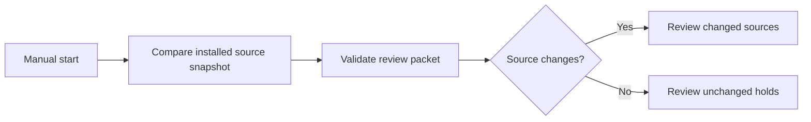

# Hunter OS source review

A manually triggered n8n workflow compares staged Hunter source snapshots and produces a durable review packet. It calls the real Hunter domain validator and auditor. It has no model calls or Discord send nodes.

Local workflow: [Hunter OS - Source Review](http://localhost:5678/workflow/g6ENdjfxPwgg6nbQ), in the personal n8n project.

## Use it

1. Keep Docker Desktop, `n8n-n8n-1`, `n8n-runners-1`, and `animus-hunter-review` running.
2. Open the workflow and click **Execute workflow**.
3. Open **Review Changed Sources** or **Review Unchanged Holds**. Read `review_markdown` and `held_items`.

A successful execution means inspection completed. Every item stays `HELD`, even on an unchanged run. The baseline is the previous observation, not an approval. The workflow deliberately remains manual and does not need to be published or scheduled.



The later publishing path is: typed import → source verification → explicit review decision → card rendering → forum update → delivery receipt. Those stages are not enabled by this integration.

## Source scope and provenance

`sources/` contains four legacy YAML candidates and three forum Markdown documents recovered from existing Animus commits. `sources/provenance.json` identifies each original commit, path, and SHA-256. Preserve these seed bytes as evidence. Source labels such as `VERIFIED` are claims and do not grant approval.

Forum documents are compared by whole H2 sections, including introductions. These are not Discord message chunks. The four legacy candidates need migration to the current typed schema; forum sections need conversion into evidenced records.

This is **not a live synchronization of the ChatGPT MHW project**. The service reads the snapshot installed in its Docker volume. After editing local staged sources, rerun the installer to refresh that snapshot, then execute the workflow. Removed source files are removed from the installed snapshot too. The canonical Hunter database is not attached.

## Local installation and refresh

Run from the repository root. Prerequisites: Docker Desktop, the existing `n8n_default` network and n8n containers, Python 3.12+, and the local `animus-kernel:ci-repair` base image from the sandbox validation work.

```sh
docker build -f integrations/hunter_review/Dockerfile -t animus-hunter-review:local .
python3 integrations/hunter_review/install_local.py
curl --fail http://localhost:8788/healthz
```

The installer prepares new source/config volumes and validates their readability before stopping this review service. It preserves the previous container until replacement readiness succeeds and restores it if startup fails. Review history stays in its original volume. The dedicated credential ID is reused; import uses n8n's CLI without exporting existing credentials. For a different installation, use the printed credential ID when installing `workflow.ts`, then apply a 60-second workflow execution timeout and save manual success/error executions.

Docker-managed volumes avoid the macOS folder-sharing stall observed on this machine:

| Volume | Runtime access | Purpose |
| --- | --- | --- |
| `animus-hunter-review-sources-<installation-id>` | Read only | Installed source snapshot |
| `animus-hunter-review-config-<installation-id>` | Read only | Dedicated private connector token |
| `animus-hunter-review-state` | Read/write | SQLite review history and Markdown reports |

The service has a read-only root filesystem, runs as the local operator UID, drops Linux capabilities, and has memory/CPU/PID limits. Host port 8788 is bound only to 127.0.0.1. n8n reaches `http://hunter-review:8788` on its Docker network. `.local/` is private and ignored; the Docker-specific build context excludes it. Never commit it.

Previous source/config volumes, including the initial unsuffixed volumes, are retained after replacement. They are small recovery snapshots; do not remove the active mounts or the state volume. A deployment failure leaves these snapshots intact.

The service restarts with Docker unless explicitly stopped. Existing n8n containers retain their original restart policies; after a Docker restart, start them if necessary:

```sh
docker start n8n-n8n-1 n8n-runners-1 animus-hunter-review
```

## Reports and failures

SQLite is the durable review history. Requests use the n8n execution ID for idempotency. Each run's Markdown report is written atomically before advancing the baseline. A duplicate request regenerates its report and returns the same packet. A new successful inspection compares against the last saved packet. Unsafe or unreadable source files or directories abort inspection without replacing that baseline.

`latest.md` is a convenience export from committed history. If only that export fails, the review still succeeds and reports `report_export_warning` in n8n. Retrying the same request repairs the export; replaying an older request never replaces the latest export with older data.

Copy the latest Markdown report for local reading:

```sh
docker cp animus-hunter-review:/state/latest.md integrations/hunter_review/.local/latest.md
```

An HTTP failure stops the n8n execution visibly. Inspect `docker logs --tail 30 animus-hunter-review`, correct the cause, and rerun. A green result with held records requires source work, not an infrastructure restart. No notification messages are sent.

## Validation

```sh
PYTHONPATH=.:packages/core:packages/types/src:packages/contracts/src:packages/kernel/src \
  python -m pytest integrations/hunter_review/tests -q
ruff check integrations/hunter_review
```

Tests cover durable comparison/replay, changed and removed sources, malformed data, real schema validation, concurrent duplicate requests, unsafe files, authentication, browser-origin rejection, request bounds, and preservation of the previous baseline on failure. `VALIDATION.md` records real n8n executions without pinned service output.
